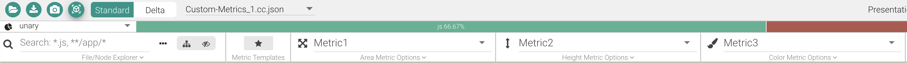

# Embedded CodeCharta

CodeCharta is embedded as an iframe in the [index.html](index.html). 
Which map is displayed can be changed via three buttons.
* JUnit4 2018 opens the metrics map from 2018
* JUnit4 2019 opens the metrics map from 2019
* JUnit4 2018&2019 opens the metrics maps from 2018 and 2019. However only the first map is selected. By hand you can now select "Delta" and compare 2019 to 2018.

## Usage

* A) Serve the index.html with a web server of your choice and open it in your favorite browser
* B) Serve the index.html via `node serve.mjs` and open it in your favorite browser

## Generate Maps

### Import Metrics from CSV

This part assumes you have installed the [CodeCharta Shell (CCSH)](https://maibornwolff.github.io/codecharta/docs/installation/) also known as the CodeCharta Analysis.
We use the [CSV Importer](https://maibornwolff.github.io/codecharta/docs/csv-importer) that is part of ccsh.

1. Transform the CSV file into a cc.json: `ccsh csvimport Custom-Metrics.csv -d ';' -o Custom-Metrics.cc.json`
2. Next open the new `cc.json` file in the web and select your new custom metrics.

### Import Metrics another way

CodeCharta provides many more importer for different sources.
See the [Quick Start Guide](https://maibornwolff.github.io/codecharta/docs/quick-start-guide/) for more examples.

If none of these fit your needs you can always create your own importer that outputs a `.cc.json`. 
The format is very simple and hasn't changed for years. 
Take a look at your generated `Custom-Metrics.cc.json` or see [here](https://maibornwolff.github.io/codecharta/docs/custom-metrics/).